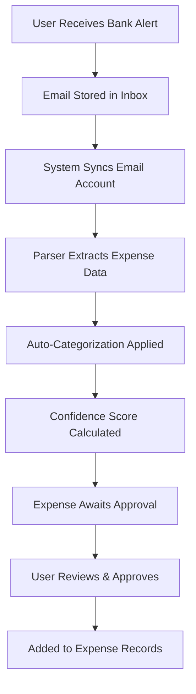

# 📧 Email Expense Integration Guide

Automatically import expenses from bank debit alerts and transaction emails.

## 🚀 **Features**

- **Multi-Bank Support**: Works with GTBank, Access Bank, First Bank, UBA, Zenith Bank, and more
- **Smart Parsing**: AI-powered extraction of amount, merchant, date, and account details
- **Auto-Categorization**: Intelligent expense categorization based on merchant names
- **Approval Workflow**: Review and approve parsed expenses before adding to records
- **Background Sync**: Automatic email scanning in the background
- **Security**: Encrypted email credentials storage

## 🏗️ **Setup Instructions**

### 1. **Database Setup**

Run the database migration:

```bash
cd backend
psql -h your-db-host -U your-username -d your-database -f scripts/setup_email_tables.sql
```

### 2. **Install Dependencies**

Add required Python packages:

```bash
pip install email imaplib ssl
```

### 3. **Email Provider Setup**

#### **Gmail Setup**
1. Enable 2-Factor Authentication in your Google Account
2. Go to Google Account Settings → Security → 2-Step Verification
3. Generate an "App Password" for your application
4. Use this app password instead of your regular password

#### **Outlook/Hotmail Setup**
1. Go to Microsoft Account Security settings
2. Enable 2-Factor Authentication
3. Generate an App Password
4. Use IMAP server: `outlook.office365.com`

#### **Yahoo Mail Setup**
1. Enable 2-Factor Authentication
2. Generate App Password in Account Security
3. Use IMAP server: `imap.mail.yahoo.com`

### 4. **Frontend Integration**

Add the component to your expenses page:

```typescript
import EmailExpenseSync from '@/components/expenses/EmailExpenseSync';

// In your expenses page
<EmailExpenseSync />
```

## 📱 **Usage Guide**

### **Connect Email Account**

1. Click "Connect Email" button
2. Enter your email address
3. Select your email provider
4. Enter your App Password (not regular password!)
5. Click "Connect"

### **Sync Expenses**

1. Select connected email account
2. Click "Sync" button
3. Wait for background processing
4. Review parsed expenses

### **Approve Expenses**

1. Review parsed expense details
2. Check confidence score (aim for >80%)
3. Verify merchant name and amount
4. Click "Approve" to add to expense records

## 🔧 **Supported Banks & Email Patterns**

### **Nigerian Banks**
- **GTBank**: Debit Alert patterns
- **Access Bank**: Transaction Alert patterns
- **First Bank**: POS and ATM transaction patterns
- **UBA**: Account debit notifications
- **Zenith Bank**: SMS to email alerts
- **Fidelity Bank**: Transaction notifications
- **Sterling Bank**: Account alerts

### **International Banks**
- Generic patterns for most banks worldwide
- Customizable parsing rules

## 🏷️ **Auto-Categorization**

Expenses are automatically categorized based on merchant names:

| Category | Keywords |
|----------|----------|
| Food & Beverage | restaurant, cafe, bar, food, pizza, kfc |
| Transportation | uber, bolt, taxi, fuel, petrol |
| Groceries | supermarket, shoprite, spar, market |
| Utilities | electric, power, water, phcn, dstv |
| Entertainment | cinema, movie, netflix, spotify |
| Healthcare | hospital, clinic, pharmacy, medical |
| Shopping | mall, store, boutique, clothing |
| Bank Charges | charge, fee, commission, maintenance |

## 🔒 **Security Features**

- **Encrypted Storage**: Email passwords encrypted in database
- **App Passwords**: Use app-specific passwords, not main passwords
- **Row-Level Security**: Users can only access their own data
- **Audit Logging**: All sync activities are logged
- **Permission Controls**: Role-based access to email integration

## 🛠️ **Configuration Options**

### **Environment Variables**

```env
# Email encryption key (for production)
EMAIL_ENCRYPTION_KEY=your-encryption-key

# IMAP connection timeouts
IMAP_TIMEOUT=30

# Background sync frequency (minutes)
SYNC_FREQUENCY=60
```

### **Custom Bank Patterns**

Add custom parsing patterns in `email_expense_parser.py`:

```python
'your_bank': {
    'patterns': [
        r'Custom pattern for your bank alerts',
        r'Amount:\s*([0-9,]+\.?\d*)\s*.*Merchant:\s*([A-Za-z0-9\s&\-\.]+)'
    ]
}
```

## 📊 **API Endpoints**

| Endpoint | Method | Description |
|----------|--------|-------------|
| `/email-expenses/setup` | POST | Connect email account |
| `/email-expenses/accounts` | GET | List connected accounts |
| `/email-expenses/sync/{account_id}` | POST | Sync emails manually |
| `/email-expenses/expenses/{account_id}` | GET | Get parsed expenses |
| `/email-expenses/expenses/{expense_id}/approve` | POST | Approve expense |

## 🔍 **Troubleshooting**

### **Connection Issues**

1. **"Failed to connect"**:
   - Check app password is correct
   - Verify IMAP is enabled for your email
   - Check firewall/network restrictions

2. **"No expenses found"**:
   - Verify bank sends alerts to connected email
   - Check if alerts are in spam folder
   - Ensure alert format matches parsing patterns

3. **Low confidence scores**:
   - Add custom patterns for your bank
   - Verify email content contains clear amount/merchant info
   - Check for non-standard alert formats

### **Performance Issues**

1. **Slow syncing**:
   - Reduce sync frequency
   - Limit `days_back` parameter
   - Check email server response times

2. **Memory usage**:
   - Process emails in smaller batches
   - Clear processed emails from queue
   - Monitor background task resources

## 🎯 **Best Practices**

1. **Setup Dedicated Email**: Use a dedicated email for bank alerts
2. **Regular Syncing**: Set up automated daily syncs
3. **Review Regularly**: Check parsed expenses weekly
4. **Custom Categories**: Add business-specific expense categories
5. **Backup Data**: Regular backups of parsed expense data

## 🔄 **Workflow Example**



## 🆘 **Support**

For issues or custom bank integration requests:

1. Check existing patterns in `email_expense_parser.py`
2. Add custom patterns for your bank
3. Test with sample alert emails
4. Submit feedback for improvements

---

**Note**: This feature requires app-specific passwords, not your regular email password. Never store regular passwords in the system.