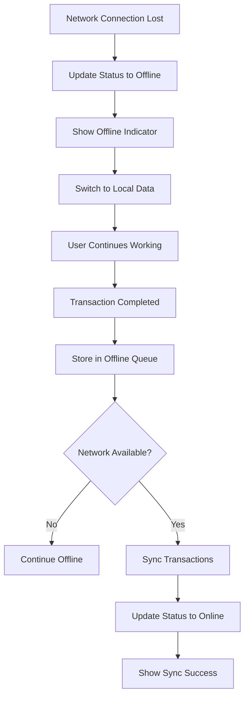

# POS Frontend UI Design Documentation

## Table of Contents
1. [Design Philosophy](#design-philosophy)
2. [UI Layout Overview](#ui-layout-overview)
3. [Screen Layouts & Wireframes](#screen-layouts--wireframes)
4. [Component Design System](#component-design-system)
5. [User Interaction Flows](#user-interaction-flows)
6. [Responsive Design](#responsive-design)
7. [Accessibility Features](#accessibility-features)
8. [Visual Design Specifications](#visual-design-specifications)

## Design Philosophy

### Nigerian Market Focus
The POS interface is designed specifically for Nigerian supermarket operations with consideration for:
- **Local Payment Methods**: Cash, bank transfer, POS cards, mobile money
- **Currency**: Nigerian Naira (₦) with appropriate formatting
- **VAT Calculations**: Standard 7.5% Nigerian VAT rate
- **Offline-First**: Designed to work seamlessly without internet connectivity
- **Touch-Optimized**: Large buttons and controls for finger navigation

### User Experience Principles
1. **Speed & Efficiency**: Minimize clicks to complete common tasks
2. **Error Prevention**: Clear visual feedback and confirmation dialogs
3. **Accessibility**: High contrast, large fonts, keyboard navigation
4. **Consistency**: Uniform design patterns across all screens
5. **Forgiveness**: Easy undo operations and error recovery

## UI Layout Overview

### Main Dashboard Layout (1920×1080 - Landscape Tablet)

```
┌─────────────────────────────────────────────────────────────────┐
│                           HEADER BAR                            │
├─────────────────┬─────────────────┬─────────────────┬───────────┤
│   Products: 456 │   Cart: 3 items │  Total: ₦8,450  │ Sales: ₦0 │
├─────────────────┴─────────────────┴─────────────────┴───────────┤
│                                                                 │
│  PRODUCT SECTION (66% width)    │    CART SECTION (34% width)  │
│  ┌─────────────────────────────┐ │ ┌─────────────────────────┐  │
│  │      Search & Filters       │ │ │     Shopping Cart       │  │
│  ├─────────────────────────────┤ │ ├─────────────────────────┤  │
│  │                             │ │ │                         │  │
│  │       Product Grid          │ │ │      Cart Items         │  │
│  │   (5 columns × 4 rows)      │ │ │                         │  │
│  │                             │ │ │                         │  │
│  │  ┌───┐ ┌───┐ ┌───┐ ┌───┐   │ │ ├─────────────────────────┤  │
│  │  │   │ │   │ │   │ │   │   │ │ │      Cart Totals        │  │
│  │  └───┘ └───┘ └───┘ └───┘   │ │ ├─────────────────────────┤  │
│  │  ┌───┐ ┌───┐ ┌───┐ ┌───┐   │ │ │   [CHECKOUT BUTTON]     │  │
│  │  │   │ │   │ │   │ │   │   │ │ └─────────────────────────┘  │
│  │  └───┘ └───┘ └───┘ └───┘   │ │                             │
│  └─────────────────────────────┘ │                             │
└─────────────────────────────────────────────────────────────────┘
```

### Component Hierarchy Visual
```
POSDashboard
├── Header
│   ├── OutletInfo ("Ikeja Mall Branch • John Doe")
│   └── StatusIndicators
│       ├── OnlineStatus (🟢 Online / 🔴 Offline)
│       └── OfflineTransactions ("3 offline transactions")
├── StatsRow
│   ├── ProductsWidget ("Products: 456")
│   ├── CartWidget ("Cart Items: 3")
│   ├── TotalWidget ("Cart Total: ₦8,450")
│   └── SalesWidget ("Today's Sales: ₦0")
├── MainContent
│   ├── ProductSection
│   │   ├── SearchBar ("Search products or scan barcode...")
│   │   ├── CategoryFilter (Dropdown: "All Categories")
│   │   └── ProductGrid
│   │       └── ProductCard[] (20 visible items)
│   └── CartSection
│       ├── CartHeader ("Shopping Cart (3)")
│       ├── CartItems[]
│       │   └── CartItem (product info, quantity controls)
│       ├── CartTotals
│       │   ├── Subtotal: ₦7,800
│       │   ├── Discount: -₦100
│       │   ├── Tax (7.5%): ₦577.50
│       │   └── Total: ₦8,277.50
│       └── CheckoutButton
└── Modals
    ├── PaymentModal (when checkout clicked)
    ├── ProductDetail (when product tapped)
    └── ReceiptPreview (after successful payment)
```

## Screen Layouts & Wireframes

### 1. Main POS Dashboard

**Layout Specifications:**
- Screen Size: 1920×1080 (landscape tablet orientation)
- Grid: 12-column responsive grid
- Spacing: 16px base unit (1rem)
- Product Grid: 5×4 layout (20 products visible)

```ascii
Header Bar (Full Width - 80px height)
┌─────────────────────────────────────────────────────────────┐
│ 🏪 Ikeja Mall Branch • 👤 John Doe    📶 Online  📊 3 offline│
└─────────────────────────────────────────────────────────────┘

Stats Widgets Row (Full Width - 120px height)
┌──────────────┬──────────────┬──────────────┬──────────────┐
│   📦 Products │   🛒 Cart    │  💰 Total    │  📈 Sales    │
│      456     │   3 items    │   ₦8,450     │     ₦0       │
└──────────────┴──────────────┴──────────────┴──────────────┘

Main Content Area (Full Width - Remaining height ~880px)
┌─────────────────────────────────────┬─────────────────────┐
│          PRODUCT SECTION            │    CART SECTION     │
│              (66% width)            │     (34% width)     │
│                                     │                     │
│ Search Bar + Category Filter        │ 🛒 Shopping Cart (3)│
│ ┌─────────────────────────────────┐ │ ┌─────────────────┐ │
│ │ 🔍 Search products or scan...   │ │ │ Rice 5kg        │ │
│ │                                 │ │ │ ₦2,500 × 2      │ │
│ └─────────────────────────────────┘ │ │ [-] 2 [+] 🗑️   │ │
│                                     │ ├─────────────────┤ │
│ Product Grid (5×4)                  │ │ Beans 2kg       │ │
│ ┌────┬────┬────┬────┬────┐          │ │ ₦1,800 × 1      │ │
│ │Rice│Bean│Oil │Egg │Milk│          │ │ [-] 1 [+] 🗑️   │ │
│ │₦2k │₦1k │₦3k │₦800│₦2k │          │ ├─────────────────┤ │
│ ├────┼────┼────┼────┼────┤          │ │                 │ │
│ │Tom │Oni │Pep │Gar │Car │          │ │ Subtotal: ₦7,800│ │
│ │₦500│₦300│₦200│₦100│₦400│          │ │ Discount: -₦100 │ │
│ ├────┼────┼────┼────┼────┤          │ │ Tax (7.5%): ₦578│ │
│ │... │... │... │... │... │          │ │ =============== │ │
│ │    │    │    │    │    │          │ │ Total: ₦8,278   │ │
│ └────┴────┴────┴────┴────┘          │ │                 │ │
│                                     │ │ [  CHECKOUT  ]  │ │
│                                     │ └─────────────────┘ │
└─────────────────────────────────────┴─────────────────────┘
```

### 2. Product Card Design

```ascii
Product Card (240px × 280px)
┌─────────────────────────┐
│                         │
│    📦 Product Image     │ ← 240×180px image area
│      or Package Icon   │
│                         │
├─────────────────────────┤
│ Uncle Ben's Rice 5kg    │ ← Product name (2 lines max)
│ SKU: RICE001           │ ← SKU code
│ Grains                 │ ← Category
│                        │
│ ₦2,500.00              │ ← Price (bold, large)
│                        │
│ 📊 In Stock    [45]    │ ← Stock status + quantity
└─────────────────────────┘
```

### 3. Shopping Cart Item Design

```ascii
Cart Item (320px width)
┌────────────────────────────────────┐
│ Uncle Ben's Rice 5kg               │ ← Product name
│ SKU: RICE001                       │ ← SKU
│ ₦2,500.00 each                     │ ← Unit price
│                                    │
│ [-] [  2  ] [+]              🗑️   │ ← Quantity controls + delete
│                                    │
│ Discount: ₦50.00 [✏️]              │ ← Discount (editable)
│                                    │
│ Line Total: ₦4,950.00              │ ← Calculated total
└────────────────────────────────────┘
```

### 4. Payment Modal Layout

```ascii
Payment Modal (800px × 600px - Centered overlay)
┌─────────────────────────────────────────────────────────┐
│  💳 Process Payment                              [×]    │
├─────────────────────────────────────────────────────────┤
│                                                         │
│ 📶 Online Mode                                          │
│                                                         │
│ 📋 Order Summary                                        │
│ ┌─────────────────────────────────────────────────────┐ │
│ │ Subtotal:                              ₦7,800.00   │ │
│ │ Discount:                             -₦100.00     │ │
│ │ Tax (7.5%):                            ₦577.50     │ │
│ │ ═══════════════════════════════════════════════     │ │
│ │ TOTAL:                                ₦8,277.50     │ │
│ └─────────────────────────────────────────────────────┘ │
│                                                         │
│ 👤 Customer Name (Optional)                             │
│ ┌─────────────────────────────────────────────────────┐ │
│ │ [Enter customer name for receipt]                   │ │
│ └─────────────────────────────────────────────────────┘ │
│                                                         │
│ 💳 Payment Method                                       │
│ ┌─────────┬─────────┬─────────┬─────────┐              │
│ │   💵    │   🏦    │   💳    │   📱    │              │
│ │  CASH   │TRANSFER │ POS CARD│ MOBILE  │              │
│ │ (Active)│         │         │  MONEY  │              │
│ └─────────┴─────────┴─────────┴─────────┘              │
│                                                         │
│ 🧮 Cash Payment                                         │
│ Amount Tendered: [₦10,000.00] 🔢                       │
│ Quick: [₦8,278] [₦9,000] [₦10,000] [₦15,000]          │
│                                                         │
│ 💚 Change Due: ₦1,722.50                               │
│                                                         │
│ [  CANCEL  ]              [  COMPLETE PAYMENT  ] 🧾    │
└─────────────────────────────────────────────────────────┘
```

## Component Design System

### Color Palette
```css
/* Primary Colors */
--primary-blue: #3B82F6;      /* Action buttons */
--primary-green: #10B981;     /* Success states */
--primary-red: #EF4444;       /* Errors/warnings */

/* Nigerian Brand Colors */
--naira-green: #008751;       /* Currency amounts */
--offline-orange: #F59E0B;    /* Offline indicators */

/* Neutral Colors */
--gray-50: #F9FAFB;          /* Backgrounds */
--gray-100: #F3F4F6;         /* Card backgrounds */
--gray-900: #111827;         /* Primary text */

/* Status Colors */
--success: #10B981;          /* In stock, online */
--warning: #F59E0B;          /* Low stock, offline */
--error: #EF4444;            /* Out of stock, errors */
```

### Typography Scale
```css
/* Font Family */
font-family: 'Inter', -apple-system, BlinkMacSystemFont, system-ui;

/* Type Scale */
--text-xs: 12px;     /* Helper text, SKUs */
--text-sm: 14px;     /* Body text, labels */
--text-base: 16px;   /* Default text */
--text-lg: 18px;     /* Card titles */
--text-xl: 20px;     /* Section headers */
--text-2xl: 24px;    /* Page titles */
--text-3xl: 30px;    /* Dashboard header */

/* Price Typography */
--price-small: 16px;    /* Unit prices */
--price-medium: 20px;   /* Cart totals */
--price-large: 28px;    /* Final total */
```

### Button Specifications
```css
/* Primary Button (Checkout, Payment) */
.btn-primary {
  background: #10B981;
  color: white;
  padding: 12px 24px;
  border-radius: 8px;
  font-weight: 600;
  min-height: 48px;
  min-width: 120px;
}

/* Secondary Button (Cancel, Clear) */
.btn-secondary {
  background: #F3F4F6;
  color: #374151;
  border: 1px solid #D1D5DB;
  padding: 12px 24px;
  border-radius: 8px;
}

/* Icon Button (Quantity controls) */
.btn-icon {
  width: 40px;
  height: 40px;
  border-radius: 50%;
  background: #F3F4F6;
  display: flex;
  align-items: center;
  justify-content: center;
}

/* Touch targets minimum 44px × 44px */
.touch-target {
  min-width: 44px;
  min-height: 44px;
}
```

### Card Components
```css
/* Product Card */
.product-card {
  width: 240px;
  height: 280px;
  background: white;
  border: 2px solid #E5E7EB;
  border-radius: 12px;
  padding: 16px;
  transition: all 0.15s ease;
}

.product-card:hover {
  border-color: #3B82F6;
  box-shadow: 0 4px 12px rgba(59, 130, 246, 0.15);
  transform: translateY(-2px);
}

.product-card.out-of-stock {
  opacity: 0.6;
  border-color: #D1D5DB;
  cursor: not-allowed;
}

/* Cart Item Card */
.cart-item {
  background: #F9FAFB;
  border: 1px solid #E5E7EB;
  border-radius: 8px;
  padding: 12px;
  margin-bottom: 8px;
}
```

## User Interaction Flows

### 1. Add Product to Cart Flow
```mermaid
graph TD
    A[Tap Product Card] --> B{Product Available?}
    B -->|Yes| C[Add to Cart Animation]
    B -->|No| D[Show "Out of Stock" Message]
    C --> E[Update Cart Count]
    C --> F[Update Cart Total]
    C --> G[Show Green Checkmark]
    G --> H[Return to Product Grid]
    D --> H
```

### 2. Checkout Process Flow
```mermaid
graph TD
    A[Tap Checkout Button] --> B{Cart Empty?}
    B -->|Yes| C[Show "Cart Empty" Alert]
    B -->|No| D[Open Payment Modal]
    D --> E[Select Payment Method]
    E --> F{Payment Method?}
    F -->|Cash| G[Enter Tendered Amount]
    F -->|Other| H[Confirm Payment]
    G --> I[Calculate Change]
    I --> H
    H --> J{Online?}
    J -->|Yes| K[Process Payment Online]
    J -->|No| L[Store Offline Transaction]
    K --> M[Show Receipt]
    L --> N[Show Offline Receipt]
    M --> O[Clear Cart]
    N --> O
    O --> P[Return to Dashboard]
```

### 3. Barcode Scanning Flow
```mermaid
graph TD
    A[Type in Search Bar] --> B{Length > 8?}
    B -->|No| C[Show Search Results]
    B -->|Yes| D[Press Enter Key]
    D --> E[Treat as Barcode]
    E --> F{Product Found?}
    F -->|Yes| G[Add to Cart]
    F -->|No| H[Show "Product Not Found"]
    G --> I[Clear Search Bar]
    H --> I
    I --> J[Return to Product Grid]
```

### 4. Offline Mode Behavior


## Responsive Design

### Breakpoint Strategy
```css
/* Device-specific breakpoints */
@media (min-width: 768px) {  /* Tablet Portrait */
  .product-grid { grid-template-columns: repeat(3, 1fr); }
  .main-layout { flex-direction: column; }
}

@media (min-width: 1024px) { /* Tablet Landscape */
  .product-grid { grid-template-columns: repeat(4, 1fr); }
  .main-layout { flex-direction: row; }
}

@media (min-width: 1280px) { /* Large Tablet/Desktop */
  .product-grid { grid-template-columns: repeat(5, 1fr); }
  .stats-row { display: flex; }
}

@media (min-width: 1920px) { /* Large Display */
  .product-grid { grid-template-columns: repeat(6, 1fr); }
  .container { max-width: 1920px; }
}
```

### Touch-Friendly Design
```css
/* Minimum touch target sizes */
.touch-element {
  min-width: 44px;
  min-height: 44px;
  position: relative;
}

/* Spacing between touch elements */
.touch-grid > * {
  margin: 4px;
}

/* Visual feedback for touch */
.touch-element:active {
  transform: scale(0.95);
  background-color: rgba(59, 130, 246, 0.1);
}
```

## Accessibility Features

### ARIA Labels and Roles
```html
<!-- Product Grid -->
<div role="grid" aria-label="Product selection">
  <div role="gridcell" aria-label="Rice 5kg, ₦2,500, In stock">
    <button aria-describedby="product-details">
      <!-- Product content -->
    </button>
  </div>
</div>

<!-- Shopping Cart -->
<section aria-label="Shopping cart" role="region">
  <h2>Shopping Cart (<span aria-live="polite">3</span> items)</h2>
  <ul role="list">
    <li role="listitem">
      <!-- Cart item -->
    </li>
  </ul>
</section>

<!-- Payment Modal -->
<dialog role="dialog" aria-labelledby="payment-title" aria-modal="true">
  <h2 id="payment-title">Process Payment</h2>
  <!-- Modal content -->
</dialog>
```

### Keyboard Navigation
```css
/* Focus indicators */
.focusable:focus {
  outline: 2px solid #3B82F6;
  outline-offset: 2px;
  box-shadow: 0 0 0 4px rgba(59, 130, 246, 0.25);
}

/* Skip links */
.skip-link {
  position: absolute;
  top: -40px;
  left: 6px;
  background: #000;
  color: #fff;
  padding: 8px;
  text-decoration: none;
  z-index: 1000;
}

.skip-link:focus {
  top: 6px;
}
```

### Screen Reader Support
```typescript
// Live regions for dynamic updates
const announceToScreenReader = (message: string) => {
  const announcement = document.createElement('div');
  announcement.setAttribute('aria-live', 'polite');
  announcement.setAttribute('aria-atomic', 'true');
  announcement.className = 'sr-only';
  announcement.textContent = message;

  document.body.appendChild(announcement);
  setTimeout(() => document.body.removeChild(announcement), 1000);
};

// Usage examples
announceToScreenReader('Item added to cart');
announceToScreenReader('Payment completed successfully');
announceToScreenReader('Now offline - transactions will be stored locally');
```

## Visual Design Specifications

### Loading States
```css
/* Skeleton loading for product grid */
.skeleton {
  background: linear-gradient(
    90deg,
    #f0f0f0 25%,
    #e0e0e0 50%,
    #f0f0f0 75%
  );
  background-size: 200% 100%;
  animation: loading 1.5s infinite;
}

@keyframes loading {
  0% { background-position: 200% 0; }
  100% { background-position: -200% 0; }
}

/* Spinner for actions */
.spinner {
  width: 20px;
  height: 20px;
  border: 2px solid #f3f3f3;
  border-top: 2px solid #3498db;
  border-radius: 50%;
  animation: spin 1s linear infinite;
}

@keyframes spin {
  0% { transform: rotate(0deg); }
  100% { transform: rotate(360deg); }
}
```

### Animations and Transitions
```css
/* Page transitions */
.page-enter {
  opacity: 0;
  transform: translateX(50px);
}

.page-enter-active {
  opacity: 1;
  transform: translateX(0);
  transition: all 300ms ease-out;
}

/* Cart item addition */
.cart-item-enter {
  opacity: 0;
  transform: scale(0.8);
  background-color: #10B981;
}

.cart-item-enter-active {
  opacity: 1;
  transform: scale(1);
  background-color: #F9FAFB;
  transition: all 500ms ease-out;
}

/* Button press feedback */
.button:active {
  transform: scale(0.95);
  transition: transform 100ms ease-out;
}

/* Modal animations */
.modal-backdrop {
  opacity: 0;
  transition: opacity 200ms ease-out;
}

.modal-backdrop.show {
  opacity: 1;
}

.modal {
  transform: scale(0.8) translateY(-50px);
  opacity: 0;
  transition: all 300ms cubic-bezier(0.34, 1.56, 0.64, 1);
}

.modal.show {
  transform: scale(1) translateY(0);
  opacity: 1;
}
```

### Status Indicators
```css
/* Online/Offline status */
.status-indicator {
  display: inline-flex;
  align-items: center;
  padding: 4px 12px;
  border-radius: 9999px;
  font-size: 12px;
  font-weight: 600;
}

.status-online {
  background-color: #D1FAE5;
  color: #065F46;
}

.status-offline {
  background-color: #FEF3C7;
  color: #92400E;
  animation: pulse 2s infinite;
}

@keyframes pulse {
  0%, 100% { opacity: 1; }
  50% { opacity: 0.7; }
}

/* Stock level indicators */
.stock-in { background: #D1FAE5; color: #065F46; }
.stock-low { background: #FEF3C7; color: #92400E; }
.stock-out { background: #FEE2E2; color: #991B1B; }
```

### Currency Formatting
```typescript
// Nigerian Naira formatting function
const formatNaira = (amount: number): string => {
  return new Intl.NumberFormat('en-NG', {
    style: 'currency',
    currency: 'NGN',
    minimumFractionDigits: 2,
    maximumFractionDigits: 2
  }).format(amount);
};

// Examples:
// formatNaira(2500) → "₦2,500.00"
// formatNaira(1500.5) → "₦1,500.50"
// formatNaira(150000) → "₦150,000.00"
```

### Error States and Feedback
```css
/* Error message styling */
.error-message {
  background-color: #FEE2E2;
  border: 1px solid #FECACA;
  color: #991B1B;
  padding: 12px 16px;
  border-radius: 8px;
  display: flex;
  align-items: center;
  margin: 8px 0;
}

.error-icon {
  color: #EF4444;
  margin-right: 8px;
}

/* Success feedback */
.success-message {
  background-color: #D1FAE5;
  border: 1px solid #A7F3D0;
  color: #065F46;
  padding: 12px 16px;
  border-radius: 8px;
  display: flex;
  align-items: center;
  margin: 8px 0;
}

/* Form validation */
.input-error {
  border-color: #EF4444;
  box-shadow: 0 0 0 1px #EF4444;
}

.input-error:focus {
  border-color: #EF4444;
  box-shadow: 0 0 0 3px rgba(239, 68, 68, 0.1);
}
```

---

*This UI design documentation provides comprehensive guidelines for implementing the POS frontend interface. The design prioritizes usability, accessibility, and efficiency for Nigerian supermarket operations.*