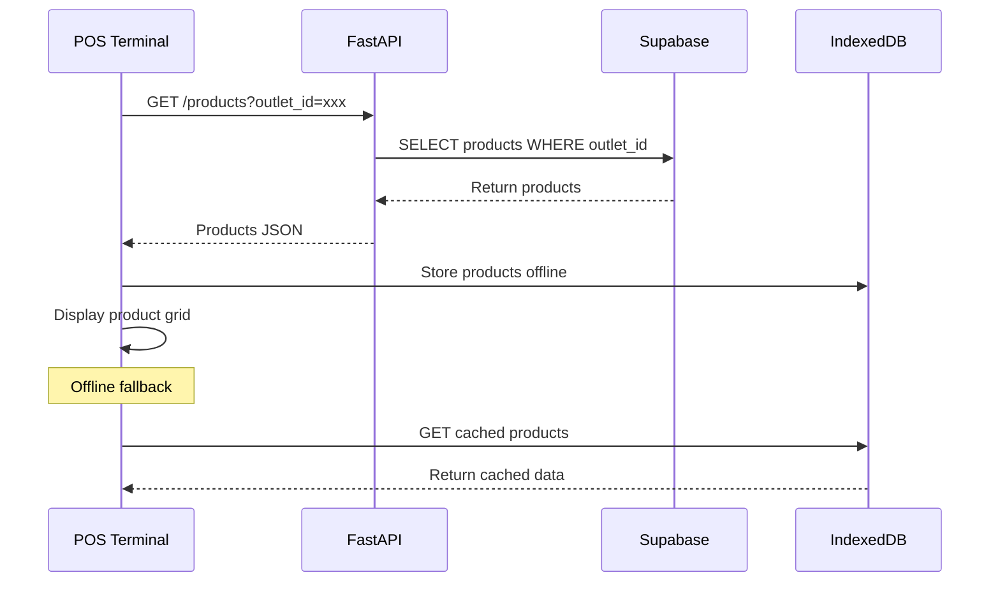
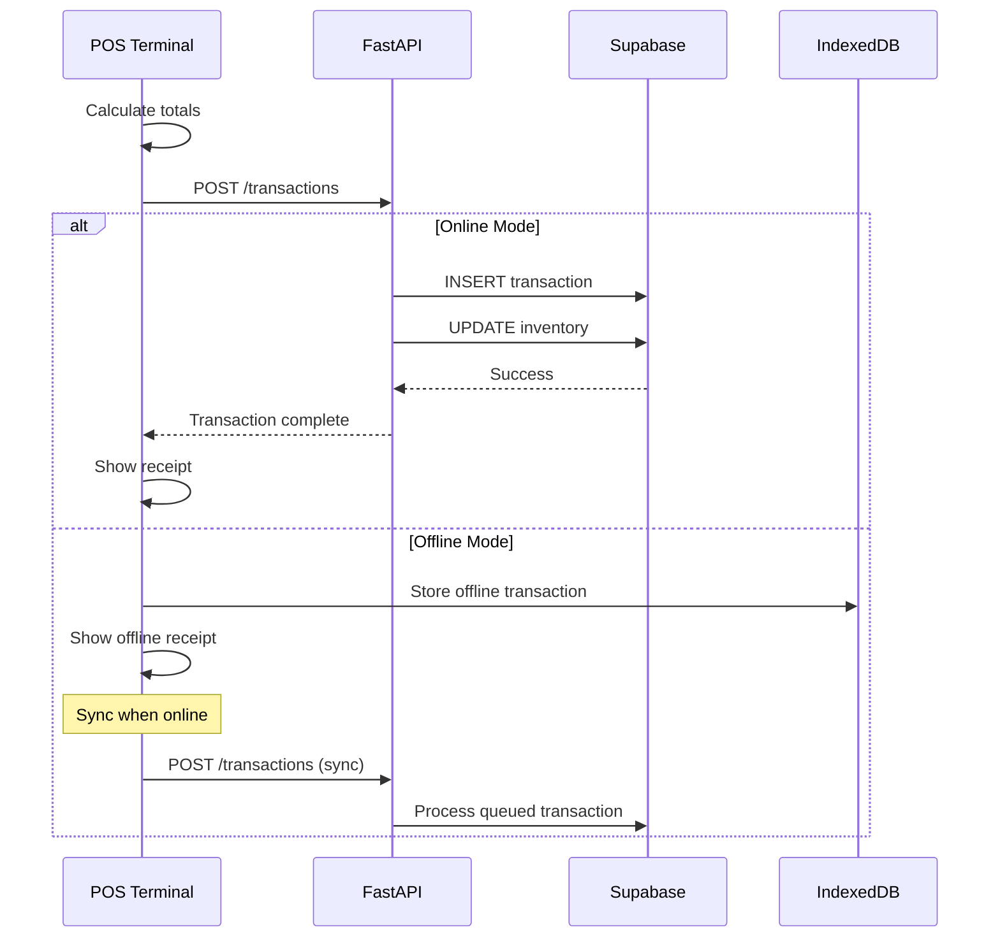
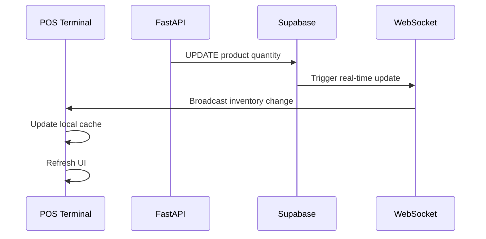

# POS System Technical Architecture Documentation

## Table of Contents
1. [System Overview](#system-overview)
2. [Architecture Components](#architecture-components)
3. [Data Flow & Integration](#data-flow--integration)
4. [Database Schema](#database-schema)
5. [API Architecture](#api-architecture)
6. [Frontend Architecture](#frontend-architecture)
7. [Offline-First Implementation](#offline-first-implementation)
8. [Security & Authentication](#security--authentication)
9. [Performance Considerations](#performance-considerations)
10. [Deployment Architecture](#deployment-architecture)

## System Overview

### High-Level Architecture (Separated Concerns)
```
┌──────────────────────────┐    ┌──────────────────────────┐
│      POS APPLICATION     │    │     ADMIN DASHBOARD      │
│    (pos.compazz.app)     │    │    (app.compazz.app)     │
│                          │    │                          │
│   • Offline-First PWA    │    │   • Online-First SPA     │
│   • Cashier Focused      │    │   • Management/Finance   │
│   • Local Storage Heavy  │    │   • Analytics Heavy      │
└────────────┬─────────────┘    └─────────────┬────────────┘
             │                                │
             └───────────────┬────────────────┘
                             │
                  ┌──────────┴───────────┐
                  │    SHARED API GATEWAY │
                  │     (FastAPI Layer)   │
                  └──────────┬───────────┘
                             │
                  ┌──────────┴───────────┐
                  │  SUPABASE POSTGRESQL │
                  │   (Shared Database)  │
                  └──────────────────────┘
```

### Domain & Codebase Strategy

**1. Domain Strategy: Subdomain Separation**
*   **`pos.compazz.app`**: Dedicated to the Point of Sale terminal.
    *   **Reason**: Isolates the Service Worker scope for offline capabilities. If the dashboard crashes or clears cache, the POS is unaffected. Allows for aggressive caching strategies specific to the POS.
*   **`app.compazz.app`**: The existing financial dashboard.
*   **`api.compazz.app`**: The shared backend REST API.

**2. Codebase Strategy: Monorepo**
We will structure the repository to house both applications side-by-side. This allows for shared Types/Interfaces while keeping build pipelines separate.

```
/project-root
  ├── /apps
  │    ├── /dashboard    # (Existing) The Admin/Finance React App
  │    └── /pos          # (New) The Standalone POS React PWA
  │
  ├── /backend           # (Existing) Shared FastAPI Python Backend
  │
  └── /shared            # Shared Types/Interfaces (optional future)
```

### Technology Stack

**Frontend (POS App):**
- **Framework**: React 19 (Vite)
- **State/Cache**: TanStack Query (React Query) + IndexedDB (Dexie.js)
- **UI**: Tailwind CSS + Shadcn UI (Lightweight)
- **Routing**: React Router (Minimal)

**Frontend (Dashboard App):**
- **Framework**: React (Existing)
- **Focus**: Charting, Reporting, Data Tables

**Backend & Infrastructure:**
- **Database**: Supabase PostgreSQL (Shared)
- **API**: FastAPI (Python 3.11+)
- **Auth**: Supabase Auth (Shared Users, Role-based separation)

## Architecture Components

### 1. Frontend Layer (React PWA)

#### Component Hierarchy
```
POSDashboard (Main Container)
├── Header
│   ├── OutletSelector
│   ├── UserInfo
│   └── OnlineStatus
├── StatsWidgets (4 widgets)
│   ├── ProductsCount
│   ├── CartItems
│   ├── CartTotal
│   └── TodaysSales
├── MainContent (Grid Layout)
│   ├── ProductSection (2/3 width)
│   │   ├── SearchFilters
│   │   └── POSProductGrid
│   └── CartSection (1/3 width)
│       └── POSShoppingCart
└── Modals
    ├── POSPaymentModal
    ├── ProductDetailModal
    └── ReceiptPreview
```

#### State Management Architecture
```typescript
// Global State (Context API)
interface POSState {
  // User & Session
  currentUser: User | null;
  currentOutlet: Outlet | null;
  sessionActive: boolean;

  // Products & Inventory
  products: POSProduct[];
  categories: string[];
  isLoading: boolean;

  // Shopping Cart
  cart: CartItem[];
  cartTotals: CartTotals;

  // UI State
  selectedCategory: string;
  searchQuery: string;
  showPaymentModal: boolean;

  // Network & Sync
  isOnline: boolean;
  offlineTransactionCount: number;
  lastSyncTime: Date;
}
```

### 2. Backend Layer (FastAPI)

#### API Endpoint Structure
```
/api/v1/pos/
├── products/
│   ├── GET    /                    # List products with filters
│   ├── POST   /                    # Create product
│   ├── GET    /{product_id}        # Get single product
│   ├── PUT    /{product_id}        # Update product
│   ├── DELETE /{product_id}        # Deactivate product
│   └── GET    /search/barcode/{code} # Barcode lookup
├── transactions/
│   ├── GET    /                    # List transactions
│   ├── POST   /                    # Create transaction
│   ├── GET    /{transaction_id}    # Get transaction details
│   ├── PUT    /{transaction_id}/void # Void transaction
│   └── GET    /{transaction_id}/receipt # Receipt data
├── inventory/
│   ├── GET    /movements          # Stock movements
│   ├── POST   /movements          # Record movement
│   └── POST   /adjustments        # Stock adjustments
├── cash-drawer/
│   ├── GET    /sessions           # Drawer sessions
│   ├── POST   /sessions/open      # Open drawer session
│   └── PUT    /sessions/close     # Close drawer session
└── stats/
    ├── GET    /inventory          # Inventory statistics
    ├── GET    /sales              # Sales analytics
    └── GET    /performance        # Performance metrics
```

#### Service Layer Architecture
```python
# Service Layer Structure
services/
├── pos_service.py          # Core POS operations
├── inventory_service.py    # Stock management
├── transaction_service.py  # Payment processing
├── sync_service.py         # Offline/online sync
├── receipt_service.py      # Receipt generation
└── analytics_service.py    # Reporting & stats
```

### 3. Database Layer (Supabase PostgreSQL)

#### Core POS Tables
```sql
-- Products table (integrated with existing schema)
pos_products (
  id uuid PRIMARY KEY DEFAULT gen_random_uuid(),
  outlet_id uuid REFERENCES outlets(id),
  sku varchar(100) NOT NULL,
  barcode varchar(100),
  name varchar(255) NOT NULL,
  category varchar(100),
  unit_price decimal(10,2) NOT NULL,
  tax_rate decimal(5,4) DEFAULT 0.075,
  quantity_on_hand integer DEFAULT 0,
  reorder_level integer DEFAULT 10,
  is_active boolean DEFAULT true,
  created_at timestamptz DEFAULT now()
);

-- Transactions table
pos_transactions (
  id uuid PRIMARY KEY DEFAULT gen_random_uuid(),
  outlet_id uuid REFERENCES outlets(id),
  transaction_number varchar(50) UNIQUE NOT NULL,
  cashier_id uuid REFERENCES auth.users(id),
  customer_name varchar(255),
  subtotal decimal(10,2) NOT NULL,
  tax_amount decimal(10,2) NOT NULL,
  total_amount decimal(10,2) NOT NULL,
  payment_method payment_method_enum NOT NULL,
  tendered_amount decimal(10,2),
  change_amount decimal(10,2) DEFAULT 0,
  status transaction_status_enum DEFAULT 'completed',
  transaction_date timestamptz DEFAULT now()
);

-- Transaction items
pos_transaction_items (
  id uuid PRIMARY KEY DEFAULT gen_random_uuid(),
  transaction_id uuid REFERENCES pos_transactions(id),
  product_id uuid REFERENCES pos_products(id),
  quantity integer NOT NULL,
  unit_price decimal(10,2) NOT NULL,
  discount_amount decimal(10,2) DEFAULT 0,
  tax_amount decimal(10,2) NOT NULL,
  line_total decimal(10,2) NOT NULL
);
```

#### Row Level Security (RLS) Policies
```sql
-- Multi-tenant security for POS data
CREATE POLICY "Users can only access their outlet's POS data"
  ON pos_products FOR ALL
  USING (
    outlet_id IN (
      SELECT outlet_id FROM user_outlets
      WHERE user_id = auth.uid()
    )
  );

-- Similar policies for transactions, inventory, etc.
```

## Data Flow & Integration

### 1. Product Selection Flow


### 2. Transaction Processing Flow


### 3. Inventory Synchronization Flow


## API Architecture

### Request/Response Patterns

#### Product Search API
```typescript
// Request
GET /api/v1/pos/products?outlet_id=xxx&search=rice&category=grains&page=1&size=20

// Response
{
  "items": [
    {
      "id": "uuid",
      "sku": "RICE001",
      "name": "Uncle Ben's Rice 5kg",
      "category": "grains",
      "unit_price": 2500.00,
      "quantity_on_hand": 45,
      "barcode": "1234567890123",
      "image_url": "https://...",
      "is_active": true
    }
  ],
  "total": 157,
  "page": 1,
  "size": 20
}
```

#### Transaction Creation API
```typescript
// Request
POST /api/v1/pos/transactions
{
  "outlet_id": "uuid",
  "cashier_id": "uuid",
  "customer_name": "John Doe",
  "items": [
    {
      "product_id": "uuid",
      "quantity": 2,
      "unit_price": 2500.00,
      "discount_amount": 100.00
    }
  ],
  "payment_method": "cash",
  "tendered_amount": 5000.00,
  "discount_amount": 100.00
}

// Response
{
  "id": "uuid",
  "transaction_number": "TXN-20241127-001",
  "subtotal": 4900.00,
  "tax_amount": 367.50,
  "total_amount": 5267.50,
  "change_amount": -267.50,
  "receipt_data": {
    "qr_code": "data:image/png;base64...",
    "print_time": "2024-11-27T14:30:00Z"
  }
}
```

### Error Handling Strategy
```typescript
// Standardized error responses
interface APIError {
  error: string;
  message: string;
  details?: Record<string, any>;
  timestamp: string;
}

// Error types
- ValidationError (400)
- AuthenticationError (401)
- AuthorizationError (403)
- NotFoundError (404)
- ConflictError (409) - Inventory conflicts
- ServerError (500)
- ServiceUnavailableError (503) - Offline mode
```

## Frontend Architecture

### Component Design Patterns

#### 1. Container/Presentational Pattern
```typescript
// Container Component (Smart)
const POSDashboardContainer: React.FC = () => {
  const [state, setState] = useState<POSState>(initialState);

  // Business logic
  const handleAddToCart = useCallback((product: POSProduct) => {
    // Cart logic
  }, []);

  return (
    <POSDashboard
      products={state.products}
      cart={state.cart}
      onAddToCart={handleAddToCart}
      // ... other props
    />
  );
};

// Presentational Component (Dumb)
interface POSDashboardProps {
  products: POSProduct[];
  cart: CartItem[];
  onAddToCart: (product: POSProduct) => void;
}

const POSDashboard: React.FC<POSDashboardProps> = ({
  products,
  cart,
  onAddToCart
}) => {
  // Pure UI rendering
  return (
    <div className="pos-dashboard">
      <POSProductGrid products={products} onSelect={onAddToCart} />
      <POSShoppingCart cart={cart} />
    </div>
  );
};
```

#### 2. Custom Hooks for Business Logic
```typescript
// usePOSCart hook
const usePOSCart = () => {
  const [cart, setCart] = useState<CartItem[]>([]);

  const addItem = useCallback((product: POSProduct, quantity = 1) => {
    setCart(prevCart => {
      // Cart logic
    });
  }, []);

  const calculateTotals = useCallback((): CartTotals => {
    // Calculation logic
  }, [cart]);

  return { cart, addItem, removeItem, updateQuantity, calculateTotals };
};

// usePOSProducts hook
const usePOSProducts = (outletId: string) => {
  const [products, setProducts] = useState<POSProduct[]>([]);
  const [isLoading, setIsLoading] = useState(false);

  const loadProducts = useCallback(async (filters: ProductFilters) => {
    // Product loading logic with offline fallback
  }, [outletId]);

  return { products, isLoading, loadProducts, searchProducts };
};
```

### State Management Strategy

#### Context API Structure
```typescript
// POS Context Provider
const POSProvider: React.FC<{ children: ReactNode }> = ({ children }) => {
  const [state, dispatch] = useReducer(posReducer, initialState);

  const actions = {
    setProducts: (products: POSProduct[]) =>
      dispatch({ type: 'SET_PRODUCTS', payload: products }),
    addToCart: (product: POSProduct, quantity: number) =>
      dispatch({ type: 'ADD_TO_CART', payload: { product, quantity } }),
    // ... other actions
  };

  return (
    <POSContext.Provider value={{ state, actions }}>
      {children}
    </POSContext.Provider>
  );
};
```

## Offline-First Implementation

### Local Storage Architecture
```typescript
// IndexedDB Schema
interface OfflineDBSchema {
  products: {
    key: string; // product.id
    value: POSProduct & { last_sync: string };
    indexes: {
      outlet_id: string;
      sku: string;
      barcode: string;
      category: string;
    };
  };

  offline_transactions: {
    key: string; // offline_id
    value: CreateTransactionRequest & {
      offline_id: string;
      created_at: string;
      sync_status: 'pending' | 'syncing' | 'synced' | 'failed';
    };
  };

  sync_queue: {
    key: string;
    value: {
      type: 'product_update' | 'inventory_adjust' | 'transaction';
      data: any;
      attempts: number;
      last_attempt: string;
    };
  };
}
```

### Sync Strategy
```typescript
class SyncManager {
  async syncWhenOnline(): Promise<void> {
    if (!navigator.onLine) return;

    try {
      // 1. Sync offline transactions
      await this.syncOfflineTransactions();

      // 2. Sync inventory updates
      await this.syncInventoryChanges();

      // 3. Pull latest product data
      await this.pullProductUpdates();

      // 4. Update sync status
      await this.updateLastSyncTime();

    } catch (error) {
      console.error('Sync failed:', error);
      // Retry with exponential backoff
    }
  }

  private async syncOfflineTransactions(): Promise<void> {
    const offlineTransactions = await offlineDB.getOfflineTransactions();

    for (const transaction of offlineTransactions) {
      try {
        const result = await posService.createTransaction(transaction);
        await offlineDB.removeOfflineTransaction(transaction.offline_id);

        // Update UI
        this.notifyTransactionSynced(result);

      } catch (error) {
        // Mark as failed, retry later
        await offlineDB.updateSyncStatus(transaction.offline_id, 'failed');
      }
    }
  }
}
```

### Conflict Resolution
```typescript
// Handle inventory conflicts during sync
interface ConflictResolution {
  strategy: 'server_wins' | 'client_wins' | 'merge' | 'prompt_user';

  async resolveInventoryConflict(
    localData: any,
    serverData: any
  ): Promise<any> {
    switch (this.strategy) {
      case 'server_wins':
        return serverData;

      case 'client_wins':
        await this.pushToServer(localData);
        return localData;

      case 'merge':
        return this.mergeData(localData, serverData);

      case 'prompt_user':
        return await this.promptUserForResolution(localData, serverData);
    }
  }
}
```

## Security & Authentication

### JWT Token Management
```typescript
// Token handling in POS context
interface POSSecurityContext {
  accessToken: string;
  refreshToken: string;
  outletPermissions: OutletPermission[];
  posPermissions: POSPermission[];
}

// Permission-based access
const checkPOSPermission = (
  action: POSAction,
  user: User,
  outlet: Outlet
): boolean => {
  const userOutletRole = getUserOutletRole(user.id, outlet.id);
  return hasPermission(userOutletRole, action);
};

// POS-specific permissions
enum POSPermission {
  PROCESS_SALES = 'pos:process_sales',
  MANAGE_INVENTORY = 'pos:manage_inventory',
  VIEW_REPORTS = 'pos:view_reports',
  MANAGE_PRODUCTS = 'pos:manage_products',
  VOID_TRANSACTIONS = 'pos:void_transactions',
  OPEN_CASH_DRAWER = 'pos:open_drawer'
}
```

### Data Encryption
```typescript
// Sensitive data encryption for offline storage
class OfflineDataEncryption {
  private async encryptSensitiveData(data: any): Promise<string> {
    // Encrypt customer data, payment info, etc.
    const key = await this.getDerivedKey();
    return await crypto.subtle.encrypt(
      { name: 'AES-GCM' },
      key,
      new TextEncoder().encode(JSON.stringify(data))
    );
  }

  private async getDerivedKey(): Promise<CryptoKey> {
    // Derive encryption key from user session
    const keyMaterial = await crypto.subtle.importKey(
      'raw',
      new TextEncoder().encode(sessionStorage.getItem('pos_session')),
      { name: 'PBKDF2' },
      false,
      ['deriveKey']
    );

    return crypto.subtle.deriveKey(
      {
        name: 'PBKDF2',
        salt: new TextEncoder().encode('pos_salt'),
        iterations: 100000,
        hash: 'SHA-256'
      },
      keyMaterial,
      { name: 'AES-GCM', length: 256 },
      false,
      ['encrypt', 'decrypt']
    );
  }
}
```

## Performance Considerations

### Frontend Optimizations
```typescript
// Virtual scrolling for large product catalogs
import { FixedSizeGrid as Grid } from 'react-window';

const ProductGridVirtualized: React.FC = ({ products }) => {
  const Row = ({ columnIndex, rowIndex, style }) => {
    const itemIndex = rowIndex * COLUMNS_PER_ROW + columnIndex;
    const product = products[itemIndex];

    return (
      <div style={style}>
        {product && <ProductCard product={product} />}
      </div>
    );
  };

  return (
    <Grid
      columnCount={COLUMNS_PER_ROW}
      columnWidth={CARD_WIDTH}
      height={GRID_HEIGHT}
      rowCount={Math.ceil(products.length / COLUMNS_PER_ROW)}
      rowHeight={CARD_HEIGHT}
      width={GRID_WIDTH}
    >
      {Row}
    </Grid>
  );
};

// Memoization for cart calculations
const useCartTotals = (cart: CartItem[]) => {
  return useMemo(() => {
    let subtotal = 0;
    let totalTax = 0;
    let totalDiscount = 0;

    cart.forEach(item => {
      const lineSubtotal = item.unitPrice * item.quantity;
      const lineDiscount = item.discount * item.quantity;
      const taxableAmount = lineSubtotal - lineDiscount;
      const lineTax = taxableAmount * item.product.tax_rate;

      subtotal += lineSubtotal;
      totalDiscount += lineDiscount;
      totalTax += lineTax;
    });

    return {
      subtotal,
      totalDiscount,
      totalTax,
      total: subtotal - totalDiscount + totalTax
    };
  }, [cart]);
};
```

### Backend Optimizations
```python
# Database connection pooling
from sqlalchemy.pool import QueuePool

engine = create_engine(
    DATABASE_URL,
    poolclass=QueuePool,
    pool_size=20,
    max_overflow=30,
    pool_pre_ping=True,
    pool_recycle=300
)

# Caching strategy
from functools import lru_cache
import redis

redis_client = redis.Redis(host='localhost', port=6379, db=0)

@lru_cache(maxsize=1000)
def get_product_by_barcode(barcode: str, outlet_id: str) -> POSProduct:
    # Cache barcode lookups
    cache_key = f"barcode:{barcode}:{outlet_id}"
    cached = redis_client.get(cache_key)

    if cached:
        return POSProduct.parse_raw(cached)

    product = db.query(POSProduct).filter(
        POSProduct.barcode == barcode,
        POSProduct.outlet_id == outlet_id
    ).first()

    if product:
        redis_client.setex(cache_key, 300, product.json())

    return product

# Bulk operations for inventory updates
async def bulk_update_inventory(
    updates: List[InventoryUpdate]
) -> List[POSProduct]:
    async with db.begin() as conn:
        # Use bulk update for better performance
        stmt = update(POSProduct).where(
            POSProduct.id.in_([u.product_id for u in updates])
        )

        for update_item in updates:
            stmt = stmt.values(
                quantity_on_hand=POSProduct.quantity_on_hand + update_item.quantity_change
            ).where(POSProduct.id == update_item.product_id)

        await conn.execute(stmt)
```

## Deployment Architecture

### Production Environment
```yaml
# docker-compose.production.yml
version: '3.8'
services:
  frontend:
    image: nginx:alpine
    volumes:
      - ./dist:/usr/share/nginx/html
      - ./nginx.conf:/etc/nginx/nginx.conf
    ports:
      - "80:80"
      - "443:443"
    environment:
      - NODE_ENV=production

  backend:
    image: pos-backend:latest
    replicas: 3
    environment:
      - DATABASE_URL=${DATABASE_URL}
      - JWT_SECRET=${JWT_SECRET}
      - SUPABASE_KEY=${SUPABASE_KEY}
    ports:
      - "8000-8002:8000"

  load-balancer:
    image: nginx:alpine
    depends_on:
      - backend
    volumes:
      - ./nginx-lb.conf:/etc/nginx/nginx.conf
    ports:
      - "80:80"

  redis:
    image: redis:alpine
    volumes:
      - redis_data:/data
    ports:
      - "6379:6379"
```

### CDN & Static Assets
```typescript
// Progressive Web App configuration
// public/manifest.json
{
  "name": "Compazz POS Terminal",
  "short_name": "Compazz POS",
  "description": "Point of Sale system for Nigerian supermarkets",
  "start_url": "/pos",
  "display": "fullscreen",
  "orientation": "landscape",
  "theme_color": "#1f2937",
  "background_color": "#ffffff",
  "icons": [
    {
      "src": "/icons/icon-192.png",
      "sizes": "192x192",
      "type": "image/png"
    },
    {
      "src": "/icons/icon-512.png",
      "sizes": "512x512",
      "type": "image/png"
    }
  ],
  "categories": ["business", "productivity"],
  "screenshots": [
    {
      "src": "/screenshots/pos-dashboard.png",
      "sizes": "1280x800",
      "type": "image/png"
    }
  ]
}

// Service Worker for offline capabilities
// public/sw.js
const CACHE_NAME = 'compazz-pos-v1';
const STATIC_ASSETS = [
  '/pos',
  '/assets/css/main.css',
  '/assets/js/main.js',
  '/icons/icon-192.png'
];

self.addEventListener('install', (event) => {
  event.waitUntil(
    caches.open(CACHE_NAME)
      .then(cache => cache.addAll(STATIC_ASSETS))
  );
});

self.addEventListener('fetch', (event) => {
  if (event.request.url.includes('/api/')) {
    // Handle API requests with network-first strategy
    event.respondWith(networkFirstStrategy(event.request));
  } else {
    // Handle static assets with cache-first strategy
    event.respondWith(cacheFirstStrategy(event.request));
  }
});
```

### Monitoring & Logging
```python
# Backend monitoring setup
import structlog
from prometheus_client import Counter, Histogram, generate_latest

# Metrics
transaction_counter = Counter('pos_transactions_total', 'Total transactions', ['outlet', 'payment_method'])
transaction_duration = Histogram('pos_transaction_duration_seconds', 'Transaction processing time')

# Structured logging
logger = structlog.get_logger()

@router.post("/transactions")
async def create_transaction(
    transaction: POSTransactionCreate,
    current_user: User = Depends(get_current_user)
):
    start_time = time.time()

    try:
        # Process transaction
        result = await transaction_service.create_transaction(transaction)

        # Log successful transaction
        logger.info(
            "transaction_created",
            transaction_id=result.id,
            outlet_id=transaction.outlet_id,
            cashier_id=current_user.id,
            total_amount=float(result.total_amount),
            payment_method=transaction.payment_method
        )

        # Update metrics
        transaction_counter.labels(
            outlet=transaction.outlet_id,
            payment_method=transaction.payment_method
        ).inc()

        transaction_duration.observe(time.time() - start_time)

        return result

    except Exception as e:
        logger.error(
            "transaction_failed",
            error=str(e),
            outlet_id=transaction.outlet_id,
            cashier_id=current_user.id
        )
        raise
```

---

*This technical architecture document provides the foundation for understanding the POS system implementation. For specific implementation details, refer to the individual component documentation and API specifications.*